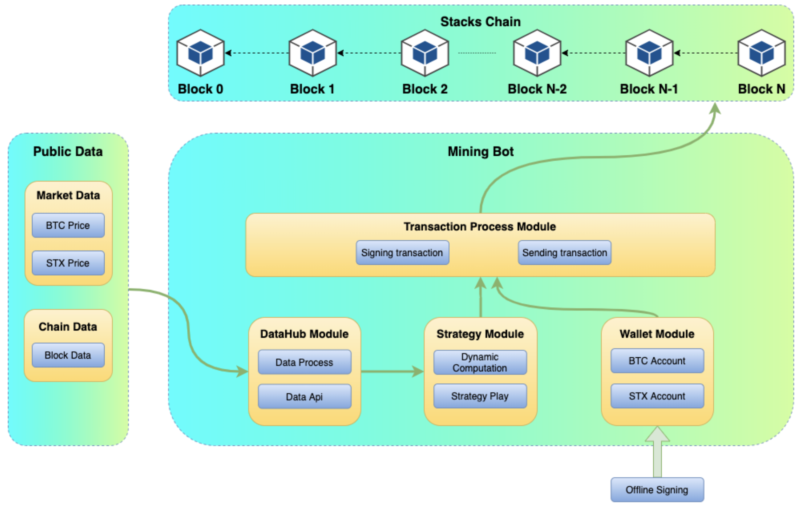

# mining-bot

## product architecture

Mining Bot includes a **stacks-blockchain node** which provides the feature to participate in the PoX consensus. A **mining-bot client** which have **Strategy Module** and **Wallet Module**. A **Public Data Client** which provides Market Data and Chain Data.

### Stacks-Chain
- forked by stacks-blockchain
- expose API in PoX process
    - /v2/mining/btcAmount
        - set btc amount for mining process
    - /v2/mining/start
        - set mining-bot start mining
    - /v2/mining/stop
        - set mining-bot stop mining

### 